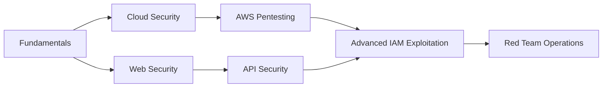

# OumaClause

  

---

## 👨‍💻 About Me

Cybersecurity student specializing in **cloud penetration testing** with a focus on AWS security architectures. I investigate cloud misconfigurations, IAM privilege escalation paths, and security detection mechanisms through hands-on lab environments and CTF challenges.

My approach combines theoretical security knowledge with practical exploitation techniques, documenting findings and methodologies for continuous learning and community contribution.

**Current Status:** Actively pursuing certifications in cloud security and offensive security methodologies.

---

## 🎯 Current Focus

<table>
<tr>
<td width="50%">

### ☁️ Cloud Security
- IAM policy abuse & privilege escalation
- S3 bucket misconfigurations & data exposure
- CloudTrail logging & threat detection
- Serverless security (Lambda, API Gateway)
- Cross-account trust exploitation

</td>
<td width="50%">

### 🔴 Offensive Tactics
- Cloud infrastructure enumeration
- Credential harvesting & lateral movement
- Container escape techniques
- Post-exploitation in cloud environments
- Security tool evasion

</td>
</tr>
</table>

---

## 🛠️ Technical Arsenal

### Cloud Platforms & Security Tools

### Offensive Security & Exploitation

### Development & Scripting

---

## 📊 GitHub Statistics

---

## 🏆 Training Platforms

| Platform | Focus Areas | Profile |
|----------|-------------|---------|
| **Hack The Box** | Penetration testing, privilege escalation, AD exploitation | [View Profile](https://app.hackthebox.com/users/2205959) |
| **TryHackMe** | Cloud security, web exploitation, network security | [View Profile](https://tryhackme.com/p/OumaClause) |

---

## 📚 Learning Path

**Current Priorities:**
- AWS Certified Security - Specialty preparation
- Advanced cloud attack simulation frameworks
- Container security and Kubernetes exploitation
- Security automation and tooling development

---

## 🔗 Connect & Collaborate

---

## 📝 Recent Activity

<!--START_SECTION:activity-->
- Lab environments and writeups are shared on my [portfolio](https://oumaclause.netlify.app)
- Contributing to cloud security tools and frameworks
- Documenting AWS security misconfigurations and exploitation techniques
<!--END_SECTION:activity-->

---

### 💡 "Security is not a product, but a process" - Bruce Schneier

**⚠️ Disclaimer:** All security research and testing activities are conducted in authorized lab environments and comply with ethical hacking guidelines.

